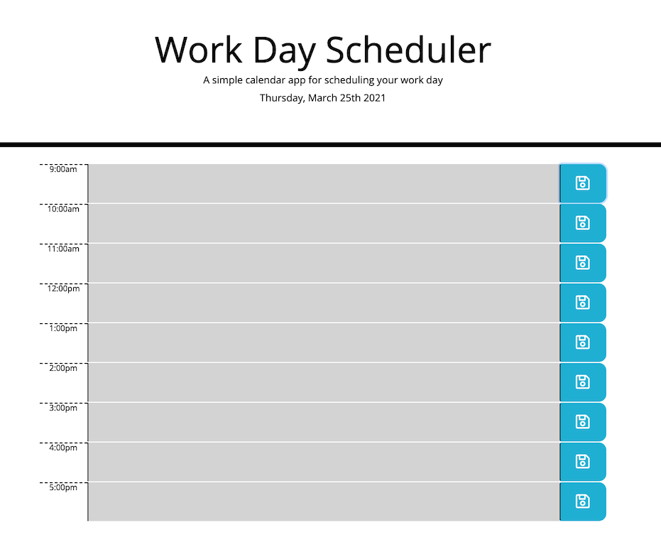

# Site Preview

## About

  An employee with a busy schedule is able to add important events to a daily planner that does not lose data on page refresh after event submission to assist in effective time management.

  The current day is displayed at the top of the planner along with timeblocks for each hour of the standard business day. The timeblocks for each hour are color coded to indicate whether the hour is in the past, present, or future. The save button to the right of each timeblock will save whatever text is inputted to the color coded blocks to the local storage correlated for that timeblock.
  
  The site may be accessed at: [its GitHub page url](https://anth8nyc.github.io/workdaysched/)

  The following gif also demonstrates the application functionality:

  
